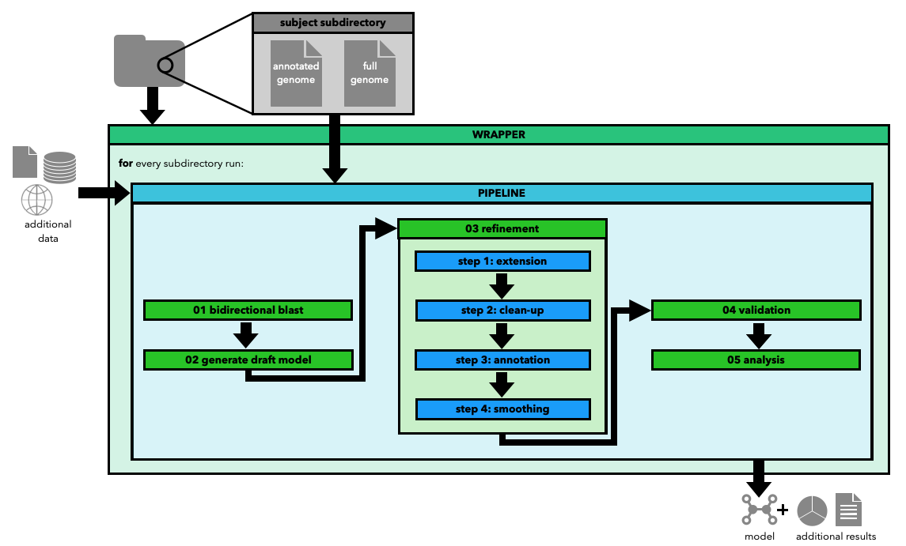

# SPECIMEN

SPECIMEN (strain-specific metabolic modelling) provides a pipeline for curating a strain-specific metabolic model from a high-quality template model with further functionalities build around this pipeline. 

## Installation  

Download this repository and run the command `pip install -e .` inside the top-level directory.     

Further required tools:
- [MCC - MassChargeCuration](https://github.com/Biomathsys/MassChargeCuration/tree/main/MCC)
- [DIAMOND, version 2.0.4 or higher](https://github.com/bbuchfink/diamond)
- [EntrezDirect](https://www.ncbi.nlm.nih.gov/books/NBK179288/), if no NCBI mapping has been created beforehand
- [BOFdat](https://github.com/jclachance/BOFdat), for running as expected, one needs to change `solution.f` to `solution.objective_value` in the `coenzymes_and_ions.py` file of the tool's files

## Quickstart

Download a default configuration file using the command `specimen setup config`. Adjust the paramaters as needed and use it to run the pipeline using the command `specimen run pipeline config.yaml`.    

To further get into SPECIMEN, try out the jupyter notebooks in the HowTo folder, which provide guides on how to run the pipeline and other functionalities of SPECIMEN.

## Documentation

Currently, see docs folder in this repository. The rendered html pages can be found in the `build` subdirectory.
  
