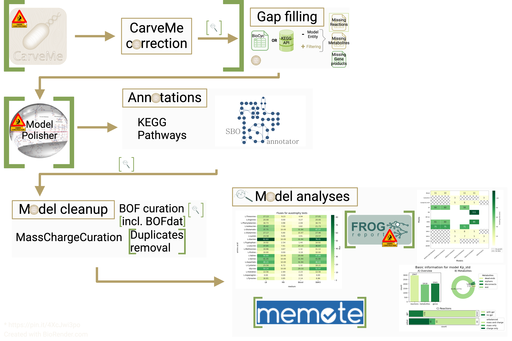

About ``CMPB``
==============

The CarveMe + ModelPolisher based (CMPB) workflow curates a model using refineGEMs and ModelPolisher.
The starting point is either the input files for CarveMe (future update) or an already built model.

This workflow aims at minimising the user's workload by concatenating steps that could be done individually with the 
integrated tools.

.. _cmpb-overview:

Overview of the ``CMPB`` worfklow
---------------------------------

The following image shows an overrview of the steps of the worfklow:

.. _cmpb_workflow:

  Workflow from CaveMe to close-to-final model

The following steps are executed in the workflow:

.. hint::
  All steps can also be performed individually.

  Many of the steps of the worfklow can be fine tuned and turned off/on. 
  Check the :doc:`configuration file <cmpb-config>` for a full list of all parameters.

- Step 0: Possible inputs

  - Model (e.g. created with CarveMe)
  - Data to create a model with CarveMe (future update)

- Step 1.A: If the model is/was built with CarveMe a correction is performed as CarveMe adds valuable information for example in the notes and not the corresponding fields of the SBML document. 
- Step 1.B: The model is gap filled. The gap fill step can be either done with a manually created file or automatically. 
- Step 2: ModelPolisher is used to enhance the annotation content (future update). 
- Step 3: Annotations

  - Adding pathways as Groups from KEGG
  - Using SBOannotator to get more specific SBO term annotations

- Step 4: Model cleanup

  - Using MassChargeCuration
  - Optionally: Using BOFdat
  - Optionally: Removing duplicates

- Step 5: Model analyses

  - Model statistics
  - Analysing growth
  - Testing for amino acid auxotrophies
  - Optionally: Analysing with FROG (future update)
  - Optionally: Analysing with MEMOTE

| For each step the model version and, optionally, the according MEMOTE report can be saved.
| All tools are accessed via refineGEMs unless stated otherwise. Steps or tools marked as future update will be added soon.

.. note::

    All accessible functions are listed in the :ref:`Contents of SPECIMEN` section.
