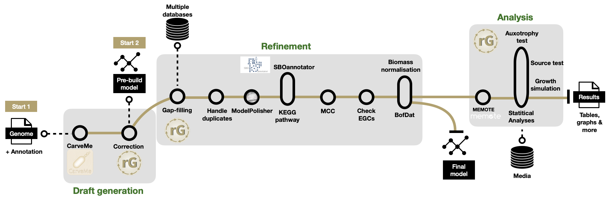

About ``CMPB``
==============

The *CarveMe + ModelPolisher based (CMPB)* workflow curates a model using ``refineGEMs`` and ``ModelPolisher``.
The starting point is either the input files for ``CarveMe`` or an already built model.

This workflow aims at minimising the user's workload by concatenating steps that could be done individually with the 
integrated tools.

.. _cmpb-overview:

Overview of the ``CMPB`` worfklow
---------------------------------

The following image shows an overview of the steps of the worfklow:

.. _cmpb_workflow:

  Workflow from ``CarveMe`` to close-to-final model

The following steps are executed in the workflow:

.. hint::
  All steps can also be performed individually.

  Many of the steps of the worfklow can be fine tuned and turned off/on. 
  Check the :doc:`configuration file <cmpb-config>` for a full list of all parameters.

- Possible inputs

  - Start 1: 
    - Data to create a model with CarveMe
  - Start 2:
    - Pre-built model (e.g. from CarveMe)

- Draft generation: If the model is/was built with ``CarveMe`` a correction is performed as ``CarveMe`` adds valuable information for example in the notes and not the corresponding fields of the SBML document. 
- Refinement: 
  
  - The model is gap filled. The gap fill step includes all available algorithmns from the ``refineGEMs`` gapfill module. 
  - The model is checked for duplicated reactions and metabolites, which can also optionally be removed.
  - ``ModelPolisher`` is used to enhance the annotation content.
  - Annotations

    - Adding pathways as Groups from KEGG
    - Using ``SBOannotator`` to get more specific SBO term annotations

  - Using MassChargeCuration
  - Check for energy generating cycles (EGCs)
  - Improve the biomass objective function (BOF)
    
    - Optionally: Apply ``BOFdat``
    - Normalise the BOF

- Analysis

  - Optionally: Analysing with ``MEMOTE``
  - Analysing the model with ``refineGEMs``

    - Model statistics
    - Analysing growth
    - Testing for amino acid auxotrophies
    
  - Optionally: Analysing with ``FROG`` (future update)
  
| For each step the model version and, optionally, the according ``MEMOTE`` report can be saved.
| All tools are accessed via ``refineGEMs`` unless stated otherwise. 
| Steps or tools marked as future update will be added in a later version of the workflow.

.. note::

    All accessible functions are listed in the :ref:`Contents of SPECIMEN` section.
