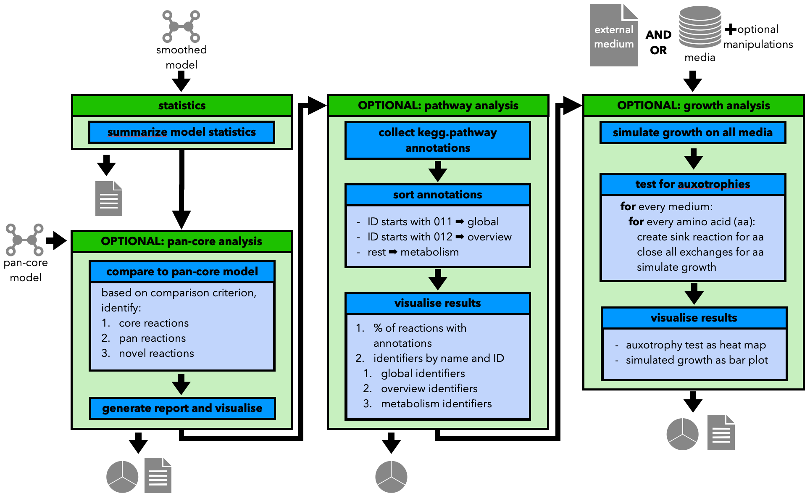

Step 5: Analyse the Model
=========================

The fifth and final step of the pipeline is to analyse the curated model and 
generate a set of tables and graphics to nicely display the model content. Most steps, 
excluding the statistical model analysis are optional and can be turned off or skipped.

Current options include:

    a. statistical analysis
    b. pathway analysis
    c. growth analysis, including *in silico* auxotrophy tests
    d. pan-core analysis, if a pan-core model is available

A graphical overview of the in and outs of this step can be found below:

