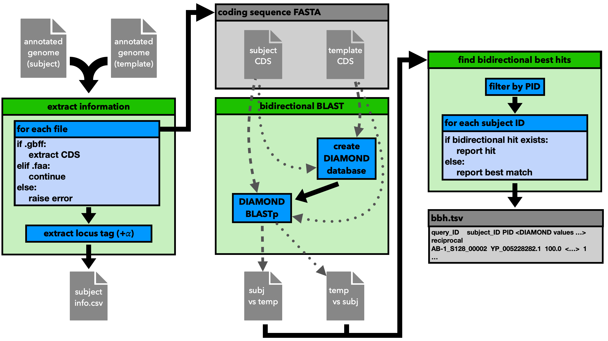

Step 1: Bidirectional BLAST
===========================

The first step of the workflow is to perform a  bidirectional BLAST using `DIAMOND <https://github.com/bbuchfink/diamond>`__ 
on the input and template genomes. The aim is to identify genes that are found 
in both genomes. The bidirectional BLAST ensures a high certainty value. The idea 
is based on the workflow described by :footcite:t:`norsigian2020workflow`.

Below is an overview of this step of the workflow:

.. footbibliography:: 