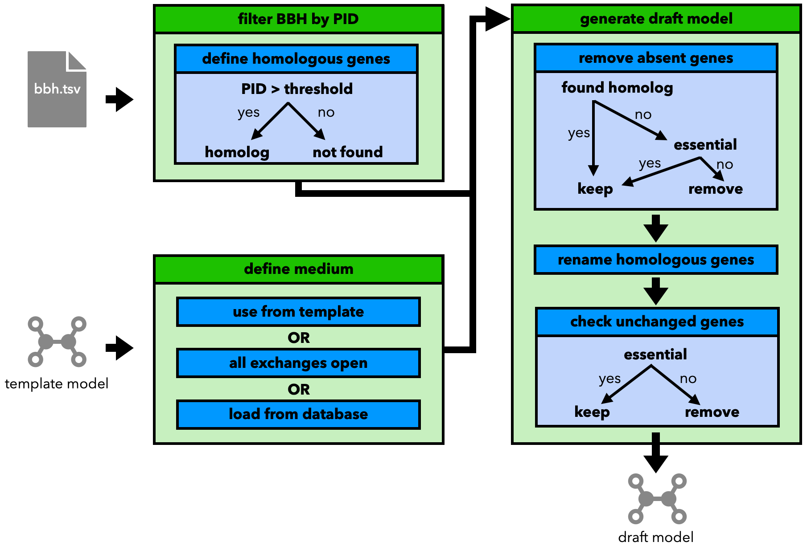

Step 2: Generate a Draft Model
==============================

Based on the results of step 1, step 2 of the pipeline generates a draft model based on the 
template model.

.. note:: 

    When running this step outside the context of the pipeline, the input files 
    need to be related to each other. The identifiers of the genes 
    for the matches of the bidirectional blast results and the genes in the template model
    are the same or can be adjusted using the given parameters as needed.

A graphical representation of the steps can be found below:

The draft model is constructed based on the idea of :footcite:t:`norsigian2020workflow` by:

- Filtering the BLAST best bidirectional hits by their percentage identity value (only matches with a PID greater than a given threshold are considered homologous).
- Choosing a medium for the new model. Options include:

    - Using the one from the template
    - Setting all exchanges to open (not advised, quickly leads to unrealistic growth rates)
    - Loading one from the ``refineGEMs`` database

- Removing genes from the template that have no (found) homolog in the template genome.

    - Under the condition, that the removed gene is not neccessary for the growth of the model

- Renaming the homologous genes to match the names of the new genome
- Checking unchanged genes

    - remove them, if they are not essential for the growth of the model 

.. footbibliography:: 
