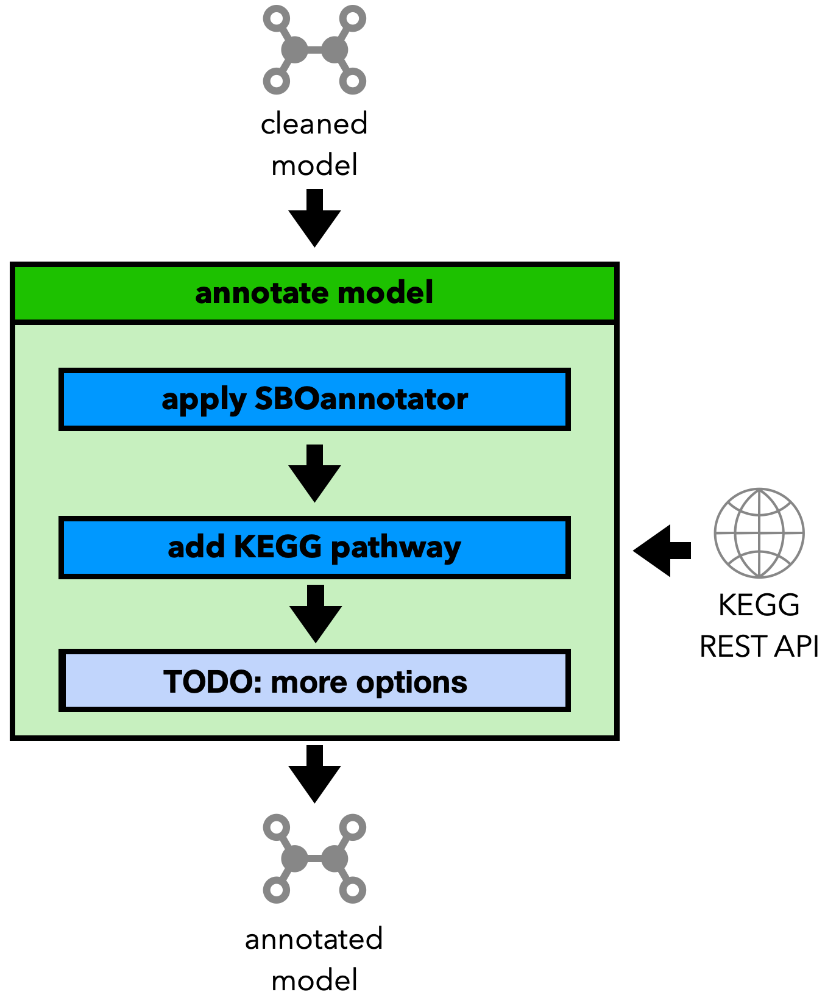

Step 3, Part 3: Further Annotate the Model
==========================================

The third part of the refinement aims to improve the annotations of the model.

As seen in the picture above, the workflow currently covers:

- SBOterm annotations
- KEGG pathway annotations for reactions

.. note::

    Our goal is to extend this module with future updates.