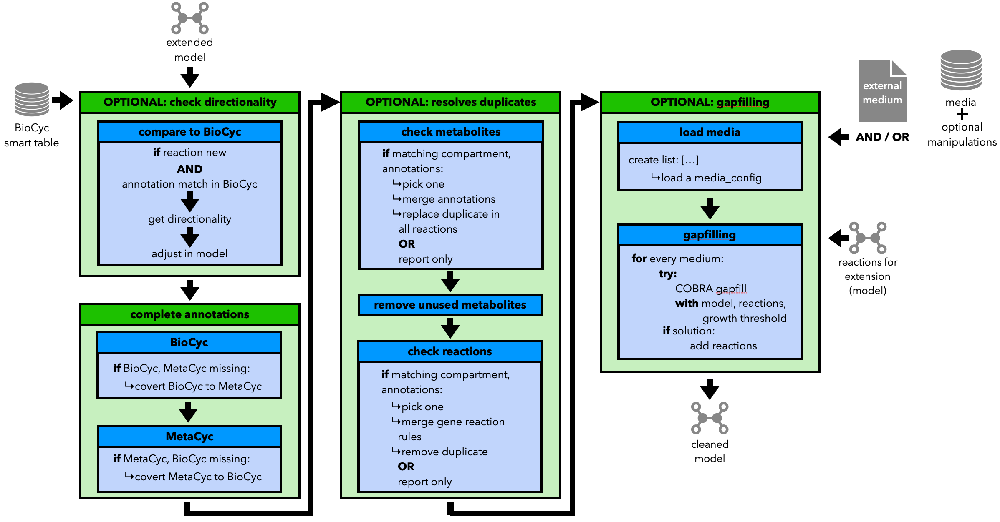

Step 3, Part 2: Cleaning the Model
==================================

The third part of the refinement aims to clean the model regarding its entities, including:

- Checking the directionality of reactions using BioCyc.
- Perform (additional) gap filling with ``GeneGapFiller`` of the ``refineGEMs`` package 
  or the ``COBRApy`` implementation
- Find and resolve duplicate metabolites and reactions. 
- Delete unused metabolites.

