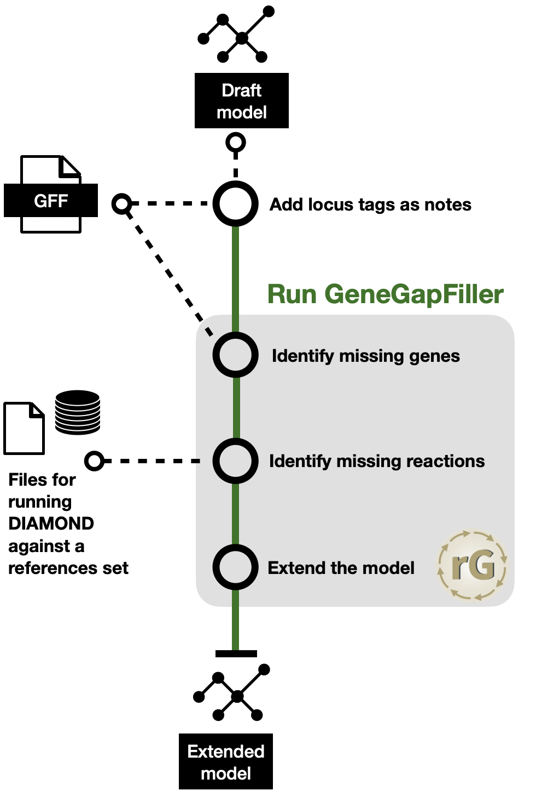

Step 3, Part 1: Extending the Model
===================================

The first part of the refinement is the extension of the model.

The aim of the extension part is to add genes, reactions and metabolites to the model from the input genome,
that have not been added to the model during the draft model generation to from a reductionist model towards a strain specific model. 

The main step of the extension is running the `GeneGapFiller` of the `refineGEMs` toolbox.
To ensure optimal performance, the locus tags of genes are added to the notes field.
In the event the draft model relies on NCBI protein IDs, the GFF is used to map these to their corresponding locus tag, if possible. 
The gap-filling should be performed with a set of genomes / organisms that are phylogenetically close to the organism of interest, as this will increase the likelihood of finding homologous genes and reactions that can be added to the model. 
The DIAMOND database has to be set-up before running this step.
After the gap-filling, the extended model is returned (and, as always, a `memote` report can potentially be generated to assess the quality of the model).