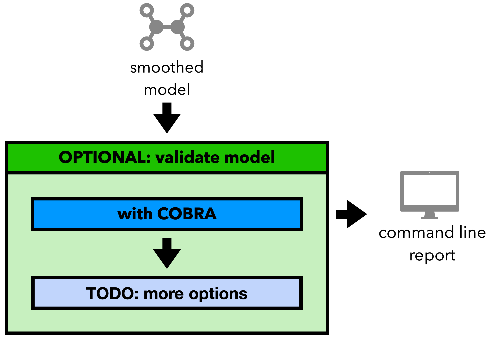

Step 4: Model Validation
========================

After the previous step, the final model of the pipeline has been generated.
To ensure the model is functional and a valid SBML model, the fourth step
of the pipeline perform a validation of the created model.

Currently implemented are the following validators (more will be added in future updates):

- SBML and COBRApy validation based on the ``cobra.io.validate_sbml_model`` function.

Which validators are run can be adjusted via parameters or in the configuration file.

A graphical representation of the part of this step can be found below.

