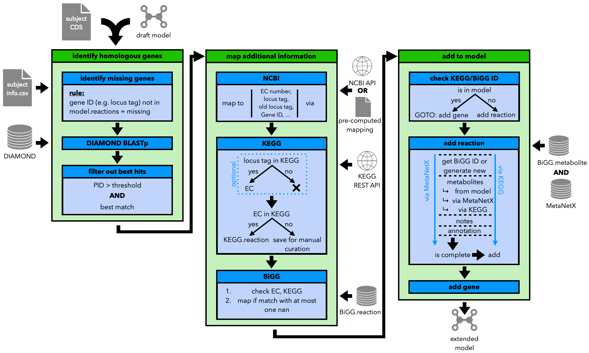

Step 3, Part 1: Extending the Model
===================================

The first part of the refinement is the extension of the model.

The aim of the extension part is to add genes, reactions and metabolites to the model from the input genome,
that have not been added to the model during the draft model generation. 

