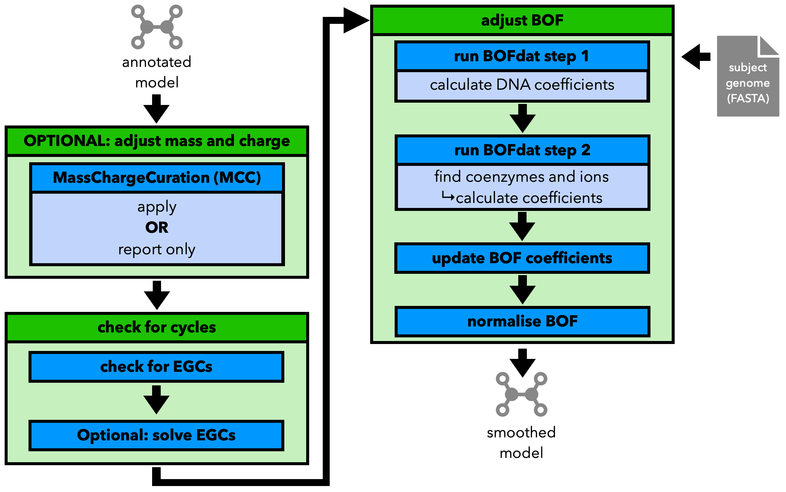

Step 3, Part 4: Smoothing
=========================

The fourth and final part of the refinement step, called smoothing, ajdusts the numerical 
information in the model, inlcuding:

- adjusting mass and charges using `MCC - MassChargeCuration <https://github.com/Biomathsys/MassChargeCuration/tree/main/MCC>`__
- checking for and optionally removing EGCs 
- adjusting the BOF 

Graphical overview below:

